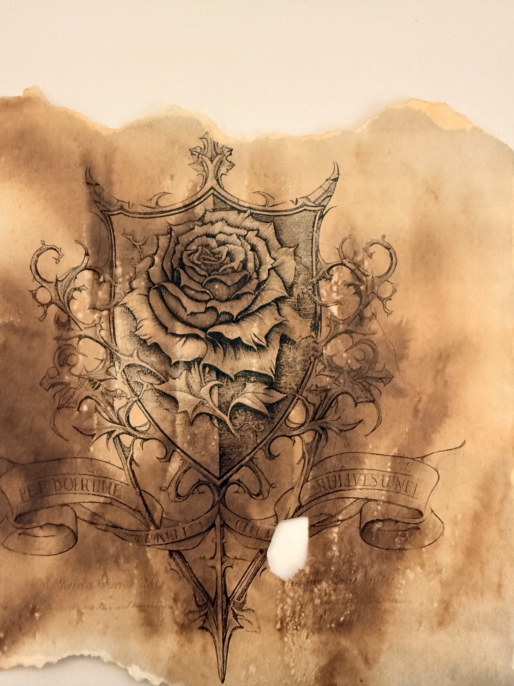

# Blessing of the Oathbound

A boon the party gained in the buried archive — the reward for swearing the Hall
of Oaths' oath and seeing the Marshal's watch ended. It manifests as a **tattoo**
each oathbound bears.

## What we know
- Grants **advantage on social interactions with dead Solamnic knights.** (session 02)
- **Once per long rest:** when **frightened**, the bearer may **reroll the save.** (session 02)
- The boon takes the form of a **tattoo** — a **Solamnic rose set on a knightly shield**, wreathed in thorns. (session 02)
- **Every party member present received it — including Renob** (despite paying nothing at the Sacrifice altars). **Pip is the only party member who did not get the blessing** — Ryan was out for the session. (session 02)
- Earned beneath the tower, tied to the **Hall of Oaths** oath and the release of the **Marshal** (and earlier **Sir Garreck**). (session 02)

## Appearance
The blessing appears as a tattoo: a detailed **Solamnic rose on a heraldic
shield**, ringed with thorned vines and banner scrolls (their mottos worn
illegible), rendered as if on aged, scorched parchment.

## Open questions
- Does "dead Solamnic knights" extend to other Solamnic spirits/undead the party may meet (e.g., the "old knight" near Solace)?
- Can **Pip** gain the blessing later, having missed the oath?

## See also
- [The Hall of Oaths](../locations/hall-of-oaths.md) · [Knights of Solamnia](../factions/knights-of-solamnia.md)
- [Sir Garreck](../npcs/sir-garreck.md) · [The Marshal](../npcs/the-marshal.md)
- [Session 02 — Descending the Tower](../../sessions/02-2026-06-12-descending-the-tower.md)
